# [プログラミング学習用]設備予約アプリ 機能仕様書

## 概要

本書は、[プログラミング学習用]設備予約アプリ における、機能ごとの仕様を記載したものである。

## 画面仕様

### 予約一覧画面（アプリトップ）

#### URL

- パス: /

- クエリパラメータ

| item | required | description                                                                              |
| ---- | :------: | ---------------------------------------------------------------------------------------- |
| date |          | 予約を表示する日付を yyyy-mm-dd 形式で指定する。 表示しない場合現在の日付を表示する |

#### (A) 日付表示

##### 表示

表示している予約のタイムラインの日付を表示する。 (クエリパラメータの日付)  
YYYY-MM-DD 形式と曜日とする。

##### クリックイベント

日付ピッカーを表示し、日付を変更できる。

日付を変更したら、クエリパラメータを変更し、その日の予約を表示する。

#### (B) 1 日前ボタン

##### クリックイベント

クエリパラメータの`date`を 1 日前にして、その日の予約を表示する。

#### (C) 1 日後ボタン

##### クリックイベント

クエリパラメータの`date`を 1 日後にして、その日の予約を表示する。

#### (D) 設備の登録 ボタン

##### クリックイベント

設備登録画面に遷移します。

#### (E) 設備の一覧

登録されている設備の一覧を表示する。

色は、8 色を定義しそれを順番に繰り返し利用する。

設備が 1 件もない場合は、その旨のメッセージを表示する。

#### (F) 設備名

設備名を表示する。

##### クリックイベント

クリックした設備の詳細画面に遷移する。

#### (G) 予約ライン

レーンの設備の予約の時間範囲を表示する。

##### クリックイベント

クリックした予約の詳細画面に遷移する。

#### (H) 時間フレーム

設備の空き時間の枠

##### マウスオーバーイベント

背景色を変えて、選択できることをしめす。

##### クリックイベント

予約の登録画面に遷移する。

選択した設備、時間が初期設定されるようにする。

### 設備詳細表示、新規作成画面

#### URL

- パス: /facilities/{id}

- パスパラメータ

| item | required | description       |
| ---- | :------: | ----------------- |
| id   |          | 表示する設備の ID |

#### ページを開いた後のイベント

パスパラメータに、ID が指定されている場合、その設備のデータをロードし、表示する。

#### (A) 設備名

テキストボックス。設備名を表示または、入力できる。

#### (B) 詳細

複数行テキストボックス。設備の詳細を表示または、入力できる。

#### (C) 登録者

登録者と登録日時を表示する。

新規作成時には、表示しない。

#### (D) 変更者

最終変更者と、変更日時を表示する。

新規作成時には、表示しない。

#### (E) 削除（リンク）

設備を削除するリンク

##### クリックイベント

削除する旨の確認メッセージを表示する。

”はい”をクリックした場合、削除 API をコールする。

成功した場合は、その旨のメッセージを表示て、予約一覧に戻る。

エラーの場合は、その旨のメッセージを表示する。

#### (F) 保存ボタン

設備の情報を保存する。

##### クリックイベント

設備予約 API をコールする。

成功した場合は、その旨のメッセージを表示て、予約一覧に戻る。

入力エラーの場合は、その部分にマークを赤く表示する。

その他のエラーの場合は、その旨のメッセージを表示する。

#### (G) クローズボタン

予約一覧に戻る。

既存の予約の表示で、内容が変更されている場合、その旨の確認メッセージを表示し、”はい”の場合は予約一覧に戻る。

### 予約詳細表示、新規作成画面

#### URL

- パス: /facilities/{id}

- パスパラメータ

| item | required | description       |
| ---- | :------: | ----------------- |
| id   |          | 表示する予約の ID |

#### ページを開いた後のイベント

パスパラメータに、ID が指定されている場合、その設備のデータをロードし、表示する。

#### (A) 設備

ドロップダウンリスト。予約の設備の表示および選択設定する。

#### (B) 予約日時

日付ピッカー。予約日時の開始、終了を表示、入力する。

#### (C) 目的

テキストボックス。予約の目的を表示、入力する。

#### (D) 詳細

複数行テキストボックス。予約の詳細の表示、入力をする。

#### (E) 登録者

登録者と登録日時を表示する。

新規作成時には、表示しない。

#### (F) 変更者

最終変更者と、変更日時を表示する。

新規作成時には、表示しない。

#### (G) 削除（リンク）

予約を削除するリンク

##### クリックイベント

削除する旨の確認メッセージを表示する。

”はい”をクリックすると、予約削除 API をコールする。

#### (H) 保存ボタン

予約の情報を保存する。

##### クリックイベント

予約保存 API をコールする。

成功した場合は、その旨のメッセージを表示て、予約一覧に戻る。

入力エラーの場合は、その部分にマークを赤く表示する。

その他のエラーの場合は、その旨のメッセージを表示する。

#### (I) クローズボタン

予約一覧に戻る。

既存の予約の表示で、内容が変更されている場合、その旨の確認メッセージを表示し、”はい”の場合は、予約一覧に戻る。

## API（サーバー機能）

### 新しい設備の登録

#### メソッド

POST

#### URL

/facilities/

#### クエリパラメータ

なし

#### リクエスト・Body

content-type: application/json

| item name   | required | value          |
| ----------- | :------: | -------------- |
| name        |    ✔     | string: 設備名 |
| description |          | string: 詳細   |

#### レスポンス: 成功時

status: 200

content-type: application/json

登録後の[設備](./schemas.md#facility)のデータを返す。

#### レスポンス: インプット・エラー

リクエストデータが、スキーマ定義にある制約に違反している場合。

status: 422

content-type: application/json

| item name | type              | description      |
| --------- | ----------------- | ---------------- |
| code      | string            | エラーコード     |
| message   | string            | エラーメッセージ |
| errors    | ValidationError[] | エラーの一覧     |

### 設備の更新

#### メソッド

PUT

#### URL

/facilities/{id}

#### パスパラメータ

| item name | required | value                     |
| --------- | :------: | ------------------------- |
| id        |    ✔     | string: 更新する設備の ID |

#### リクエスト・Body

content-type: application/json

| item name   | required | value          |
| ----------- | :------: | -------------- |
| name        |          | string: 設備名 |
| description |          | string: 詳細   |

Body にない項目は更新されない。

#### レスポンス: 成功

status: 200

content-type: application/json

変更後の[設備](./schemas.md#facility)のデータを返す。

#### レスポンス: 指定した ID の設備がない

status: 404

body: なし

#### レスポンス: インプット・エラー

status: 422

content-type: application/json

| item name | type              | description      |
| --------- | ----------------- | ---------------- |
| code      | string            | エラーコード     |
| message   | string            | エラーメッセージ |
| errors    | ValidationError[] | エラーの一覧     |

### 設備の削除

#### メソッド

DELETE

#### URL

/facilities/{id}

#### パスパラメータ

| item name | required | value                     |
| --------- | :------: | ------------------------- |
| id        |    ✔     | string: 更新する設備の ID |

#### レスポンス: 成功

status code: 204

#### レスポンス: 指定した ID の設備がない

status: 404

body: なし

### 設備の取得

#### メソッド

GET

#### URL

/facilities/{id}

#### パスパラメータ

| item name | required | value                     |
| --------- | :------: | ------------------------- |
| id        |    ✔     | string: 更新する設備の ID |

#### レスポンス: 成功

status: 200

content-type: application/json

[設備](./schemas.md#facility)のデータを返す。

#### レスポンス: 指定した ID の設備がない

status: 404

### 予約の登録

#### メソッド

POST

#### URL

/reservations/

#### リクエスト・Body

content-type: application/json

| item name   | required | value          |
| ----------- | :------: | -------------- |
| subject     |    ✔     | string: 予約名 |
| facilityId  |    ✔     | id: 設備 ID    |
| description |          | string: 詳細   |
| startDate   |    ✔     | date: 開始日   |
| endDate     |    ✔     | date: 終了日   |

#### レスポンス: 成功時

status: 200

content-type: application/json

登録後の[予約](./schemas.md#reservation)のデータを返す。

#### レスポンス: インプット・エラー

status: 422

content-type: application/json

| item name | type              | description      |
| --------- | ----------------- | ---------------- |
| code      | string            | エラーコード     |
| message   | string            | エラーメッセージ |
| errors    | ValidationError[] | エラーの一覧     |

### 予約の更新

#### メソッド

PUT

#### URL

/reservations/{id}

#### パスパラメータ

| item name | required | value                     |
| --------- | :------: | ------------------------- |
| id        |    ✔     | string: 更新する予約の ID |

#### リクエスト・Body

content-type: application/json

| item name   | required | value          |
| ----------- | :------: | -------------- |
| subject     |          | string: 予約名 |
| facilityId  |          | id: 設備 ID    |
| description |          | string: 詳細   |
| startDate   |          | date: 開始日   |
| endDate     |          | date: 終了日   |

Body にない項目は更新されない。

#### レスポンス: 成功時

status: 200

content-type: application/json

更新後の[予約](./schemas.md#reservation)のデータを返す。

#### レスポンス: 指定した ID の設備がない

status: 404

body: なし

#### レスポンス: インプット・エラー

status: 422

content-type: application/json

| item name | type              | description      |
| --------- | ----------------- | ---------------- |
| code      | string            | エラーコード     |
| message   | string            | エラーメッセージ |
| errors    | ValidationError[] | エラーの一覧     |

### 予約の削除

#### メソッド

DELETE

#### URL

/reservations/{id}

#### パスパラメータ

| item name | required | value                     |
| --------- | :------: | ------------------------- |
| id        |    ✔     | string: 更新する設備の ID |

#### レスポンス: 成功

status code: 204

#### レスポンス: 指定した ID の予約がない

status: 404

body: なし

### 予約の取得

#### メソッド

GET

#### URL

/reservations/{id}

#### パスパラメータ

| item name | required | value                     |
| --------- | :------: | ------------------------- |
| id        |    ✔     | string: 更新する設備の ID |

#### レスポンス: 成功

status code: 200

content-type: application/json

[予約](./schemas.md#reservation)のデータを返す。

#### レスポンス: 指定した ID の予約がない

status: 404

body: なし

### 予約一覧を取得する

#### メソッド

GET

#### URL

/reservations/

#### クエリパラメータ

| item name   | required | value                                 |
| ----------- | :------: | ------------------------------------- |
| date        |    ✔     | date: 予約を取得する日付              |
| facilityIds |          | string カンマ区切り: 設備の ID の一覧 |

#### レスポンス: 成功

status code: 200

content-type: application/json

[予約](./schemas.md#reservation)のデータを返す。

#### レスポンス: クエリパラメータが不正

status: 422

content-type: application/json

| item name | type              | description      |
| --------- | ----------------- | ---------------- |
| code      | string            | エラーコード     |
| message   | string            | エラーメッセージ |
| errors    | ValidationError[] | エラーの一覧     |
