#　施設予約アプリ 仕様書

## 概要

このドキュメントは、Web アプリケーション開発のチュートリアルとしての、サンプルアプリケーションです。

アプリケーションの目的は、複数のユーザーが会議室や共有備品等の設備の予約管理を行うものです。

## 要件定義

- ユーザーは メールアドレス もしくは、Google のアカウントでユーザーを判別できること。
- 施設を登録できること。
- 施設を変更・削除できること。
- 施設ごとの予約の一覧を表示できること。
- 一覧は施設でのフィルタリングできること。
- 施設ごとに予約を登録できること。
- 予約を変更・削除できること。

## ユースケース

### メールアドレスとパスワードで認証を行う

#### 概要

メールアドレスとパスワードを入力し、認証を行う。

#### アクター

- 利用者

#### 前提条件

- まだこのアプリで認証していない。

#### 事後条件

- 認証され、このアプリを利用することができる

#### 基本フロー

1. 利用者は、ブラウザでアプリの URL にアクセスする。
2. アプリは認証されていないことを確認し、認証画面の URL にリダイレクトする。
3. 利用者は、メールアドレスとパスワードを入力し、送信ボタンを押す。
4. アプリは、メールアドレスとパスワードが合っていることを確認する。
   - あっていない場合は、その旨のメッセージを表示し、再度入力を求める。
5. アプリは、'1'でアクセスした URL に遷移する。

### Google アカウントで認証を行う

#### 概要

Google アカウントを持っているユーザーは、Google の認証で利用することができる。

#### アクター

- 利用者

#### 前提条件

- まだこのアプリで認証していない。

#### 事後条件

- 認証され、このアプリを利用することができる

#### 基本フロー

1. 利用者は、ブラウザでアプリの URL にアクセスする。
2. アプリは認証されていないことを確認し、認証画面の URL にリダイレクトする。
3. 利用者は、Google のアイコンをクリックする。
4. アプリは、Google の認証画面に遷移する。
5. 利用者は、Google の認証を行う。
6. Google は、認証後本アプリの認証検証用 URL に遷移する。
7. アプリは、Google の認証を検証し、'1'でアクセスした URL に遷移する。

#### 例外フロー

7 で、Google の認証の検証が失敗した場合、予期しないエラーとして画面に表示し、ユースケースを終了する。

### 施設を登録する

#### 概要

予約の対象となる、施設を登録できる。

#### アクター

- 利用者

#### 前提条件

- 認証済みであり、予約一覧の画面を表示している。

#### 事後条件

- アプリに施設が登録され、予約一覧に表示される。

#### 基本フロー

1. 利用者は、"施設の追加"ボタンを押す。
2. アプリは、施設の新規作成画面に遷移する。
3. 利用者は、必要な項目を入力し、保存ボタンを押す。
4. アプリは、入力内容をチェックする。
   - 入力にミスがあればその旨を表示し、'3'に戻る.
5. アプリは、施設を保存する。
6. アプリは、予約一覧画面に戻り、保存した旨のメッセージを表示する。
