# ユースケース

## 概要

本書は、「[プログラミング学習用]施設予約アプリ」のユースケースおよびユースケース記述を記載したものである。

## ユースケース図

<!--
### メールアドレスとパスワードで認証を行う

#### 概要

メールアドレスとパスワードを入力し、認証を行う。

#### アクター

- 利用者

#### 前提条件

- まだこのアプリで認証していない。

#### 事後条件

- 認証され、このアプリを利用することができる

#### 基本フロー

1. 利用者は、ブラウザでアプリの URL にアクセスする。
2. アプリは認証されていないことを確認し、認証画面の URL にリダイレクトする。
3. 利用者は、メールアドレスとパスワードを入力し、送信ボタンを押す。
4. アプリは、メールアドレスとパスワードが合っていることを確認する。
   - あっていない場合は、その旨のメッセージを表示し、再度入力を求める。
5. アプリは、'1'でアクセスした URL に遷移する。 -->

### Google アカウントで認証を行う

#### 概要

Google アカウントを持っているユーザーは、Google の認証で利用することができる。

#### アクター

- 利用者

#### 前提条件

- まだこのアプリで認証していない。

#### 事後条件

- 認証され、このアプリを利用することができる

#### 基本フロー

1. 利用者は、ブラウザでアプリの URL にアクセスする。
2. アプリは認証されていないことを確認し、認証画面の URL にリダイレクトする。
3. 利用者は、Google のアイコンをクリックする。
4. アプリは、Google の認証画面に遷移する。
5. 利用者は、Google の認証を行う。
6. Google は、認証後本アプリの認証検証用 URL に遷移する。
7. アプリは、Google の認証を検証し、'1'でアクセスした URL に遷移する。

#### 例外フロー

7 で、Google の認証の検証が失敗した場合、予期しないエラーとして画面に表示し、ユースケースを終了する。

### 施設を登録する

#### 概要

施設を登録できる。

#### アクター

- 利用者

#### 前提条件

- 認証済みであり、予約一覧の画面を表示している。

#### 事後条件

- アプリに施設が登録され、予約一覧に表示される。
- 登録された施設には、ユーザー名、登録日時が記載されていること。

#### 基本フロー

1. 利用者は、"施設の追加"ボタンを押す。
2. アプリは、施設の新規作成画面に遷移する。
3. 利用者は、必要な項目を入力し、保存ボタンを押す。
4. アプリは、入力内容をチェックする。
   - 入力にミスがあればその旨を表示し、'3'に戻る.
5. アプリは、施設に登録者名を追加して保存する。
6. アプリは、予約一覧画面に戻り、保存した旨のメッセージを表示する。

### 施設を閲覧する

#### 概要

施設を閲覧できる。

#### アクター

- 利用者

#### 前提条件

- 認証済みであり、予約一覧の画面を表示している。(基本フロー 1 のみ)

#### 事後条件

- 指定した施設の情報が表示されている。

#### 基本フロー 1

1. 利用者は、予約の一覧から施設名をクリックする。
2. アプリは、指定した施設の情報のページに遷移する。

#### 基本フロー 2

1. 利用者は、施設情報画面のユニークな URL を指定する。
2. アプリは、URL で指定した施設の情報のページに遷移する。

### 施設を変更する

#### 概要

登録済みの施設を変更できる。

#### アクター

- 利用者

#### 前提条件

- 認証済みであり、予約一覧の画面を表示している。(基本フロー 1 のみ)

#### 事後条件

- 指定した施設の情報が入力された内容で変更されている。
- 施設には、最終更新者、変更日時が記載されていること。

#### 基本フロー 1

1. 利用者は、予約の一覧から施設名をクリックする。
2. アプリは、指定した施設の情報のページに遷移する。
3. 利用者は、必要な項目を変更して保存ボタンを押す。
4. アプリは、施設の情報に最終更新者の名前と日時を追加して保存する。
5. アプリは、予約一覧画面に戻り、保存が完了した旨のメッセージを表示する。

#### 基本フロー 2

1. 利用者は、施設情報画面のユニークな URL を指定する。
2. アプリは、URL で指定した施設の情報のページに遷移する。
3. 以降は"基本フロー 1 - 3"からのフローと同一のため省略する。

### 施設を削除する

#### 概要

登録済みの施設を削除できる。

#### アクター

- 利用者

#### 前提条件

- 認証済みであり、予約一覧の画面を表示している。(基本フロー 1 のみ)

#### 事後条件

- 指定した施設の情報がアプリから削除されている。
- 指定した施設の予約情報がアプリから削除されている。

#### 基本フロー 1

1. 利用者は、予約の一覧から施設名をクリックする。
2. アプリは、指定した施設の情報のページに遷移する。
3. 利用者は、削除ボタンを押す。
4. アプリは、確認のメッセージを表示する。
5. 利用者は、"はい"(or OK)をクリックする。
   - "いいえ"(or NO)をクリックしたときは、2 に戻る
6. アプリは、指定された設備とその予約情報を削除する。
7. アプリは、予約一覧画面に戻り、削除が完了した旨のメッセージを表示する。

#### 基本フロー 2

1. 利用者は、施設情報画面のユニークな URL を指定する。
2. アプリは、URL で指定した施設の情報のページに遷移する。
3. 以降は"基本フロー 1 - 3"からのフローと同一のため省略する。

### 予約を登録する

#### 概要

施設を登録できる。

#### アクター

- 利用者

#### 前提条件

- 認証済みであり、予約一覧の画面を表示している。

#### 事後条件

- アプリに予約が登録され、予約一覧に表示される。
- 登録された施設には、ユーザー名、登録日時が記載されていること。

#### 基本フロー

1. 利用者は、タイムレーンの空き時間の部分をクリックする。
2. アプリは、予約の新規作成画面に遷移する。
3. 利用者は、必要な項目を入力する。
4. 施設を入力するため、選択ボタンを押す。
5. 「施設の一覧から選択入力する」ユースケースを実施し、施設を入力する。
6. アプリは、入力内容をチェックする。
   - チェック内容は、利用時間が他の予約と重複していないか、が含まれる。
   - 入力にミスがあればその旨を表示し、'3'に戻る.
7. アプリは、予約情報に登録者名を追加して保存する。
8. アプリは、予約一覧画面に戻り、保存した旨のメッセージを表示する。

### 予約を変更する

#### 概要

登録済みの予約を変更できる。

#### アクター

- 利用者

#### 前提条件

- 認証済みであり、予約一覧の画面を表示している。(基本フロー 1 のみ)

#### 事後条件

- 指定した予約の情報が入力された内容で変更されている。
- 予約には、最終更新者、変更日時が記載されていること。

#### 基本フロー 1

1. 利用者は、予約の一覧から予約バーをクリックする。
2. アプリは、指定した予約情報のページに遷移する。
3. 利用者は、必要な項目を変更して保存ボタンを押す。
   - (option)施設を変更する場合、「施設の一覧から選択入力する」ユースケースを実施する。
4. アプリは、予約の情報に最終更新者の名前と日時を追加して保存する。
5. アプリは、予約一覧画面に戻り、保存が完了した旨のメッセージを表示する。

#### 基本フロー 2

1. 利用者は、予約情報画面のユニークな URL を指定する。
2. アプリは、URL で指定した予約の情報のページに遷移する。
3. 以降は"基本フロー 1 - 3"からのフローと同一のため省略する。

### 予約を削除する

#### 概要

登録済みの予約を削除できる。

#### アクター

- 利用者

#### 前提条件

- 認証済みであり、予約一覧の画面を表示している。(基本フロー 1 のみ)

#### 事後条件

- 指定した予約の情報が入力された内容で変更されている。

#### 基本フロー 1

1. 利用者は、予約の一覧から予約バーをクリックする。
2. アプリは、指定した予約情報のページに遷移する。
3. 利用者は、削除ボタンを押す。
4. アプリは、確認メッセージを表示する。
5. 利用者は、"はい"(or OK)をクリックする。
   - "いいえ"(or NO)をクリックしたときは、2 に戻る
6. アプリは、予約の情報を削除する。
7. アプリは、予約一覧画面に戻り、削除が完了した旨のメッセージを表示する。

#### 基本フロー 2

1. 利用者は、予約情報画面のユニークな URL を指定する。
2. アプリは、URL で指定した予約の情報のページに遷移する。
3. 以降は"基本フロー 1 - 3"からのフローと同一のため省略する。
